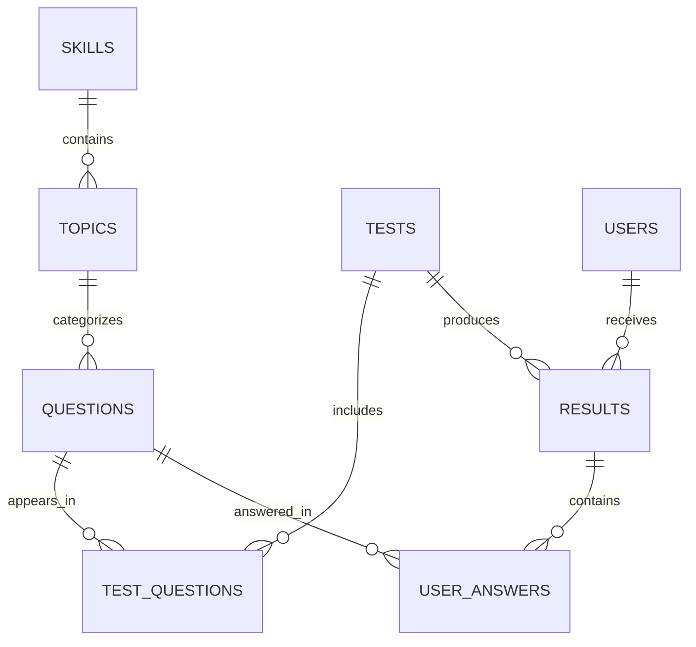

# PrepIQ Entity Relationship Diagram

```mermaid
erDiagram
    SKILLS ||--o{ TOPICS : contains
    TOPICS ||--o{ QUESTIONS : categorizes
    TESTS ||--o{ TEST_QUESTIONS : includes
    QUESTIONS ||--o{ TEST_QUESTIONS : appears_in
    USERS ||--o{ RESULTS : receives
    TESTS ||--o{ RESULTS : produces
    RESULTS ||--o{ USER_ANSWERS : contains
    QUESTIONS ||--o{ USER_ANSWERS : answered_in
```
